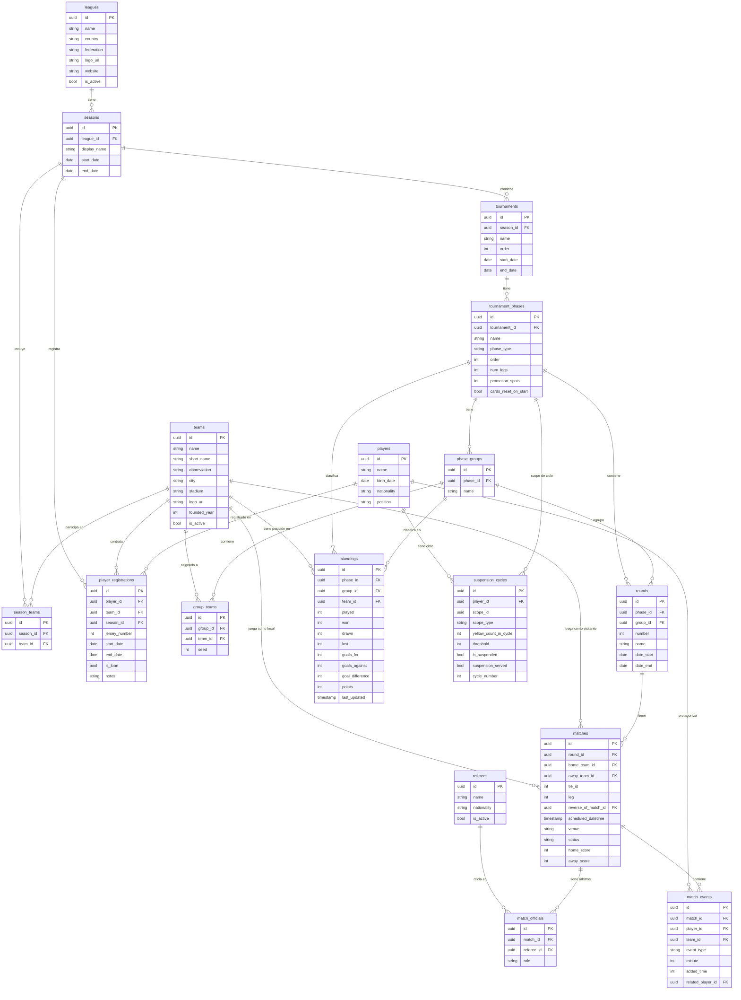

# Modelo de Base de Datos — EstadisticasFutve

Documentación del esquema relacional de la plataforma. Diseñado para soportar estadísticas detalladas de la liga venezolana de fútbol (Primera División), con flexibilidad para adaptarse a cualquier liga, categoría o formato de torneo.

---

## Índice

- [Visión general](#visión-general)
- [Diagrama de relaciones](#diagrama-de-relaciones)
- [Tablas](#tablas)
  - [leagues](#leagues)
  - [seasons](#seasons)
  - [teams](#teams)
  - [season_teams](#season_teams)
  - [players](#players)
  - [player_registrations](#player_registrations)
  - [referees](#referees)
  - [tournaments](#tournaments)
  - [tournament_phases](#tournament_phases)
  - [phase_groups](#phase_groups)
  - [group_teams](#group_teams)
  - [rounds](#rounds)
  - [matches](#matches)
  - [match_officials](#match_officials)
  - [match_events](#match_events)
  - [standings](#standings)
  - [suspension_cycles](#suspension_cycles)
- [Decisiones de diseño](#decisiones-de-diseño)

---

## Visión general

El modelo sigue una jerarquía de competencia clara:

```
Liga → Temporada → Torneo → Fase → (Grupo) → Jornada → Partido → Evento
```

Cada nivel es independiente y configurable, lo que permite representar desde una simple liga de grupos hasta formatos complejos con múltiples rondas, cuadrangulares, y finales absolutas de ida y vuelta — sin cambios de esquema entre temporadas.

### Convenciones aplicadas a todas las tablas

| Convención | Detalle |
| --- | --- |
| **Clave primaria** | `uuid` — generado por PostgreSQL con `gen_random_uuid()` (nativo desde PG 13). No es autoincremental. |
| **Claves foráneas** | `uuid` — mismo tipo que la PK referenciada. |
| **Auditoría** | Todas las tablas incluyen `created_at` y `updated_at` (`timestamp with time zone`, `NOT NULL`, valor por defecto `now()`). No se repiten en cada sección para no redundar. |
| **Tipos ENUM** | PostgreSQL ENUMs: `phase_type_enum`, `match_status_enum`, `referee_role_enum`, `event_type_enum`, `scope_type_enum`. |

---

## Diagrama de relaciones



---

## Tablas

---

### `leagues`

Representa una competición o liga. Es la entidad raíz del sistema.

| Campo        | Tipo      | Descripción                                           |
| ------------ | --------- | ----------------------------------------------------- |
| `id`         | `uuid`    | Clave primaria                                        |
| `name`       | `varchar` | Nombre completo (ej. "Primera División de Venezuela") |
| `country`    | `varchar` | País de la liga (ej. "Venezuela")                     |
| `federation` | `varchar` | Organismo rector (ej. "FUTVE", "CONMEBOL")            |
| `logo_url`   | `varchar` | URL del logo oficial                                  |
| `website`    | `varchar` | Sitio web oficial                                     |
| `is_active`  | `boolean` | Permite archivar ligas inactivas sin borrar datos     |

---

### `seasons`

Una temporada dentro de una liga. Puede abarcar un solo año calendario o cruzar dos años (ej. agosto 2024 – mayo 2025).

| Campo          | Tipo      | Descripción                                            |
| -------------- | --------- | ------------------------------------------------------ |
| `id`           | `uuid`    | Clave primaria                                         |
| `league_id`    | `uuid`    | FK → `leagues.id`                                      |
| `display_name` | `varchar` | Nombre para mostrar en UI (ej. `"2025"` o `"2024-25"`) |
| `start_date`   | `date`    | Fecha de inicio real de la temporada                   |
| `end_date`     | `date`    | Fecha de fin real de la temporada                      |

> **Nota:** Se usan fechas completas en lugar de años enteros para soportar temporadas que cruzan el año calendario.

---

### `teams`

Un equipo de fútbol como entidad permanente, independiente de la temporada en que participe.

| Campo          | Tipo         | Descripción                                      |
| -------------- | ------------ | ------------------------------------------------ |
| `id`           | `uuid`       | Clave primaria                                   |
| `name`         | `varchar`    | Nombre completo (ej. "Caracas Fútbol Club")      |
| `short_name`   | `varchar`    | Nombre corto (ej. "Caracas FC")                  |
| `abbreviation` | `varchar(3)` | Sigla de 3 letras (ej. "CAR")                    |
| `city`         | `varchar`    | Ciudad sede                                      |
| `stadium`      | `varchar`    | Nombre del estadio principal                     |
| `logo_url`     | `varchar`    | URL del escudo del equipo                        |
| `founded_year` | `integer`    | Año de fundación                                 |
| `is_active`    | `boolean`    | Permite archivar equipos disueltos o descendidos |

---

### `season_teams`

Registra qué equipos participan en cada temporada. Necesario porque los equipos pueden ascender, descender o retirarse.

| Campo       | Tipo      | Descripción       |
| ----------- | --------- | ----------------- |
| `id`        | `uuid`    | Clave primaria    |
| `season_id` | `uuid`    | FK → `seasons.id` |
| `team_id`   | `uuid`    | FK → `teams.id`   |

> **Restricción:** La combinación `(season_id, team_id)` debe ser única.

---

### `players`

Un jugador como entidad permanente. Su vínculo con equipos y temporadas se gestiona en `player_registrations`.

| Campo         | Tipo      | Descripción                                                        |
| ------------- | --------- | ------------------------------------------------------------------ |
| `id`          | `uuid`    | Clave primaria                                                     |
| `name`        | `varchar` | Nombre completo                                                    |
| `birth_date`  | `date`    | Fecha de nacimiento                                                |
| `nationality` | `varchar` | Nacionalidad                                                       |
| `position`    | `varchar` | Posición en el campo (portero, defensa, centrocampista, delantero) |

---

### `player_registrations`

Historial de vínculos entre jugadores y equipos por temporada. Permite rastrear transferencias, cesiones y cambios de equipo durante el año.

| Campo           | Tipo      | Descripción                                              |
| --------------- | --------- | -------------------------------------------------------- |
| `id`            | `uuid`    | Clave primaria                                           |
| `player_id`     | `uuid`    | FK → `players.id`                                        |
| `team_id`       | `uuid`    | FK → `teams.id`                                          |
| `season_id`     | `uuid`    | FK → `seasons.id`                                        |
| `jersey_number` | `integer` | Número de camiseta en ese período                        |
| `start_date`    | `date`    | Fecha desde la que está activo en el equipo              |
| `end_date`      | `date`    | Fecha hasta la que estuvo activo (`NULL` = aún activo)   |
| `is_loan`       | `boolean` | Indica si es cedido (en préstamo)                        |
| `notes`         | `text`    | Observaciones libres (ej. "transferencia de Monagas SC") |

> **Importante:** El `team_id` en `match_events` se almacena siempre de forma explícita en el evento y nunca se deriva de esta tabla, ya que el jugador pudo haberse transferido después del partido.

---

### `referees`

Árbitros que pueden oficiar partidos.

| Campo         | Tipo      | Descripción           |
| ------------- | --------- | --------------------- |
| `id`          | `uuid`    | Clave primaria        |
| `name`        | `varchar` | Nombre completo       |
| `nationality` | `varchar` | Nacionalidad          |
| `is_active`   | `boolean` | Si sigue en actividad |

---

### `tournaments`

Un torneo dentro de una temporada. En la Primera División venezolana, una temporada tiene tres torneos: Apertura, Clausura y Final Absoluta.

| Campo        | Tipo      | Descripción                                                      |
| ------------ | --------- | ---------------------------------------------------------------- |
| `id`         | `uuid`    | Clave primaria                                                   |
| `season_id`  | `uuid`    | FK → `seasons.id`                                                |
| `name`       | `varchar` | Nombre del torneo (ej. "Apertura", "Clausura", "Final Absoluta") |
| `order`      | `integer` | Orden de disputa dentro de la temporada (1, 2, 3…)               |
| `start_date` | `date`    | Fecha de inicio del torneo                                       |
| `end_date`   | `date`    | Fecha de fin del torneo                                          |

---

### `tournament_phases`

Las fases dentro de un torneo. **Esta tabla es el núcleo de la flexibilidad del formato.** Cada fase define su tipo, duración y comportamiento disciplinario.

| Campo                  | Tipo      | Descripción                                                                  |
| ---------------------- | --------- | ---------------------------------------------------------------------------- |
| `id`                   | `uuid`    | Clave primaria                                                               |
| `tournament_id`        | `uuid`    | FK → `tournaments.id`                                                        |
| `name`                 | `varchar` | Nombre de la fase (ej. "Ronda Regular", "Cuadrangulares", "Final")           |
| `phase_type`           | `varchar` | Tipo de fase (ver valores posibles abajo)                                    |
| `order`                | `integer` | Orden dentro del torneo                                                      |
| `num_legs`             | `integer` | Número de partidos por enfrentamiento (1 = ida simple, 2 = ida y vuelta)     |
| `promotion_spots`      | `integer` | Cuántos equipos avanzan a la siguiente fase                                  |
| `cards_reset_on_start` | `boolean` | Si las amarillas del ciclo de apercibido se reinician al inicio de esta fase |

**Valores posibles de `phase_type`:**

| Valor         | Descripción                                      |
| ------------- | ------------------------------------------------ |
| `round_robin` | Todos contra todos (liga clásica)                |
| `group_stage` | Fase de grupos (varios round-robins en paralelo) |
| `knockout`    | Eliminación directa                              |
| `two_legged`  | Eliminación directa con ida y vuelta             |

**Ejemplo — Torneo Apertura 2025:**

| `name`         | `phase_type`  | `order` | `num_legs` | `cards_reset_on_start` |
| -------------- | ------------- | ------- | ---------- | ---------------------- |
| Ronda Regular  | `round_robin` | 1       | 1          | false                  |
| Cuadrangulares | `group_stage` | 2       | 2          | true                   |
| Final          | `knockout`    | 3       | 1          | false                  |

---

### `phase_groups`

Grupos dentro de una fase de tipo `group_stage`. Por ejemplo, el Grupo A y Grupo B de los cuadrangulares.

| Campo      | Tipo      | Descripción                                 |
| ---------- | --------- | ------------------------------------------- |
| `id`       | `uuid`    | Clave primaria                              |
| `phase_id` | `uuid`    | FK → `tournament_phases.id`                 |
| `name`     | `varchar` | Nombre del grupo (ej. "Grupo A", "Grupo B") |

---

### `group_teams`

Asignación de equipos a grupos dentro de una fase.

| Campo      | Tipo      | Descripción                            |
| ---------- | --------- | -------------------------------------- |
| `id`       | `uuid`    | Clave primaria                         |
| `group_id` | `uuid`    | FK → `phase_groups.id`                 |
| `team_id`  | `uuid`    | FK → `teams.id`                        |
| `seed`     | `integer` | Posición de cabeza de serie (opcional) |

---

### `rounds`

Las jornadas dentro de una fase. En la Ronda Regular son las jornadas 1–13; en los Cuadrangulares son la fecha 1–6 de cada grupo.

| Campo        | Tipo      | Descripción                                                    |
| ------------ | --------- | -------------------------------------------------------------- |
| `id`         | `uuid`    | Clave primaria                                                 |
| `phase_id`   | `uuid`    | FK → `tournament_phases.id`                                    |
| `group_id`   | `uuid`    | FK → `phase_groups.id` (`NULL` si la fase no tiene grupos)     |
| `number`     | `integer` | Número de la jornada                                           |
| `name`       | `varchar` | Nombre descriptivo (ej. "Jornada 1", "Fecha 3 Cuadrangulares") |
| `date_start` | `date`    | Inicio del período de la jornada                               |
| `date_end`   | `date`    | Fin del período de la jornada                                  |

---

### `matches`

Un partido de fútbol. Pertenece a una jornada y contiene toda la información del encuentro.

| Campo                 | Tipo        | Descripción                                                                              |
| --------------------- | ----------- | ---------------------------------------------------------------------------------------- |
| `id`                  | `uuid`      | Clave primaria                                                                           |
| `round_id`            | `uuid`      | FK → `rounds.id`                                                                         |
| `home_team_id`        | `uuid`      | FK → `teams.id` — equipo local                                                           |
| `away_team_id`        | `uuid`      | FK → `teams.id` — equipo visitante                                                       |
| `tie_id`              | `integer`   | Agrupa los dos partidos de una eliminatoria de ida y vuelta (`NULL` si no aplica)        |
| `leg`                 | `integer`   | Número de la ida/vuelta dentro de una eliminatoria (`1` o `2`, `NULL` si no aplica)      |
| `reverse_of_match_id` | `uuid`      | FK → `matches.id` — apunta al partido del Apertura del que este es la vuelta en Clausura |
| `scheduled_datetime`  | `timestamp` | Fecha y hora programada del partido                                                      |
| `venue`               | `varchar`   | Estadio donde se juega (puede diferir del estadio habitual del local)                    |
| `status`              | `varchar`   | Estado: `scheduled`, `live`, `finished`, `postponed`, `cancelled`                        |
| `home_score`          | `integer`   | Goles del local (`NULL` hasta que termine)                                               |
| `away_score`          | `integer`   | Goles del visitante (`NULL` hasta que termine)                                           |

> **`tie_id` y `leg`:** En una final de ida y vuelta, los dos partidos comparten el mismo `tie_id`. Esto permite calcular el marcador global de la eliminatoria sumando los goles de ambos encuentros.
>
> **`reverse_of_match_id`:** En el Clausura, la localía se invierte respecto al Apertura. Este campo apunta al partido del Apertura correspondiente, permitiendo verificar automáticamente que la localía está correctamente invertida.

---

### `match_officials`

Los árbitros designados para cada partido. Un partido tiene múltiples roles de árbitro.

| Campo        | Tipo      | Descripción                                                                     |
| ------------ | --------- | ------------------------------------------------------------------------------- |
| `id`         | `uuid`    | Clave primaria                                                                  |
| `match_id`   | `uuid`    | FK → `matches.id`                                                               |
| `referee_id` | `uuid`    | FK → `referees.id`                                                              |
| `role`       | `varchar` | Rol del árbitro: `main`, `assistant_1`, `assistant_2`, `fourth_official`, `var` |

---

### `match_events`

**La tabla más importante para estadísticas.** Cada acción relevante dentro de un partido se registra como un evento con su minuto exacto.

| Campo               | Tipo      | Descripción                                                                                                     |
| ------------------- | --------- | --------------------------------------------------------------------------------------------------------------- |
| `id`                | `uuid`    | Clave primaria                                                                                                  |
| `match_id`          | `uuid`    | FK → `matches.id`                                                                                               |
| `player_id`         | `uuid`    | FK → `players.id` — protagonista del evento                                                                     |
| `team_id`           | `uuid`    | FK → `teams.id` — equipo al que pertenecía el jugador en ese momento                                            |
| `event_type`        | `varchar` | Tipo de evento (ver valores posibles abajo)                                                                     |
| `minute`            | `integer` | Minuto del partido en que ocurrió                                                                               |
| `added_time`        | `integer` | Minutos de adición (ej. `90+3` → `minute=90`, `added_time=3`)                                                   |
| `related_player_id` | `uuid`    | FK → `players.id` — jugador secundario del evento (ej. quién asistió en un gol, quién entró en una sustitución) |

**Valores posibles de `event_type`:**

| Valor              | Descripción                          |
| ------------------ | ------------------------------------ |
| `goal`             | Gol                                  |
| `own_goal`         | Autogol                              |
| `assist`           | Asistencia de gol                    |
| `yellow_card`      | Tarjeta amarilla                     |
| `second_yellow`    | Segunda amarilla (implica expulsión) |
| `red_card`         | Tarjeta roja directa                 |
| `substitution_in`  | Jugador que entra al campo           |
| `substitution_out` | Jugador que sale del campo           |
| `penalty_miss`     | Penalti fallado                      |
| `penalty_saved`    | Penalti atajado                      |

**Consultas que esta tabla responde directamente:**

- Máximo goleador del torneo
- Máximo asistidor
- Goles marcados en los últimos 15 minutos (filtro `minute >= 75`)
- Jugador con más amarillas
- Goles de local por minuto
- Estadísticas de tarjetas por árbitro (cruzando con `match_officials`)

---

### `standings`

Tabla de posiciones por fase y grupo. Es una **vista desnormalizada** que se actualiza al finalizar cada partido para evitar recalcular en cada consulta.

| Campo             | Tipo        | Descripción                                                |
| ----------------- | ----------- | ---------------------------------------------------------- |
| `id`              | `uuid`      | Clave primaria                                             |
| `phase_id`        | `uuid`      | FK → `tournament_phases.id`                                |
| `group_id`        | `uuid`      | FK → `phase_groups.id` (`NULL` si la fase no tiene grupos) |
| `team_id`         | `uuid`      | FK → `teams.id`                                            |
| `played`          | `integer`   | Partidos jugados                                           |
| `won`             | `integer`   | Victorias                                                  |
| `drawn`           | `integer`   | Empates                                                    |
| `lost`            | `integer`   | Derrotas                                                   |
| `goals_for`       | `integer`   | Goles a favor                                              |
| `goals_against`   | `integer`   | Goles en contra                                            |
| `goal_difference` | `integer`   | Diferencia de goles                                        |
| `points`          | `integer`   | Puntos acumulados                                          |
| `last_updated`    | `timestamp` | Última actualización del registro                          |

---

### `suspension_cycles`

Gestiona el sistema de apercibido: el ciclo de amarillas que genera suspensiones. **Es independiente del conteo total de amarillas del año.**

| Campo                   | Tipo      | Descripción                                                               |
| ----------------------- | --------- | ------------------------------------------------------------------------- |
| `id`                    | `uuid`    | Clave primaria                                                            |
| `player_id`             | `uuid`    | FK → `players.id`                                                         |
| `scope_type`            | `varchar` | Ámbito del ciclo: `tournament` o `phase`                                  |
| `scope_id`              | `uuid`    | ID del torneo o fase según `scope_type`                                   |
| `yellow_count_in_cycle` | `integer` | Amarillas acumuladas en el ciclo actual                                   |
| `threshold`             | `integer` | Número de amarillas que activa la suspensión (normalmente `4`)            |
| `is_suspended`          | `boolean` | Si el jugador está actualmente suspendido                                 |
| `suspension_served`     | `boolean` | Si ya cumplió la fecha de suspensión                                      |
| `cycle_number`          | `integer` | Número de ciclo completado (incrementa cada vez que se cumple la sanción) |

> **Cómo funciona:** Cuando `yellow_count_in_cycle` alcanza `threshold`, `is_suspended` pasa a `true`. El jugador cumple su fecha y `suspension_served` pasa a `true`. En la siguiente fecha, el ciclo se reinicia: `yellow_count_in_cycle = 0`, `is_suspended = false`, `suspension_served = false`, `cycle_number += 1`.
>
> **`scope_type` y `scope_id`:** Permiten configurar si el ciclo aplica a todo un torneo (`scope_type = 'tournament'`) o se reinicia por fase (`scope_type = 'phase'`), según lo determine la federación en cada competencia. El campo `cards_reset_on_start` en `tournament_phases` controla si se crea un nuevo ciclo al comenzar una fase.

---

## Decisiones de diseño

### Formato flexible por temporada

El diseño nunca asume un formato fijo. La combinación `tournaments → tournament_phases → phase_groups → rounds → matches` permite representar cualquier estructura: liga simple, grupos + playoffs, copa con octavos/cuartos/semis/final, etc. Cambiar el formato de una temporada a otra es solo cuestión de insertar registros distintos en `tournament_phases`, sin alterar el esquema.

### Eventos como fuente de verdad de estadísticas

Toda estadística derivable (goles, asistencias, tarjetas, sustituciones) se calcula desde `match_events`. Los campos `home_score` y `away_score` en `matches` son un resumen conveniente, pero los datos granulares siempre están en los eventos con su minuto exacto.

### El `team_id` siempre explícito en eventos

En `match_events` el `team_id` se guarda directamente en el evento y nunca se deriva de `player_registrations`. Esto es crítico porque un jugador puede transferirse después de que ocurrió el partido: el evento debe reflejar a qué equipo pertenecía en ese momento exacto.

### Apercibido desacoplado del total de amarillas

El sistema de apercibido (`suspension_cycles`) es completamente independiente del conteo de amarillas del año. Esto refleja la realidad del reglamento: el contador de apercibido puede reiniciarse entre fases o torneos, mientras que las amarillas acumuladas históricamente siguen en `match_events` y se pueden consultar siempre.

### `reverse_of_match_id` en partidos del Clausura

En la liga venezolana el Clausura es la vuelta del Apertura (local y visitante se invierten jornada por jornada). El campo `reverse_of_match_id` crea un vínculo explícito entre ambos partidos, facilitando la generación automática del fixture del Clausura y la verificación de localías.

### `tie_id` y `leg` para eliminatorias de ida y vuelta

Los enfrentamientos a doble partido (Final Absoluta, cuadrangulares) agrupan sus dos partidos con un `tie_id` común. Esto permite calcular el marcador global de una eliminatoria con una sola consulta agregada por `tie_id`.
